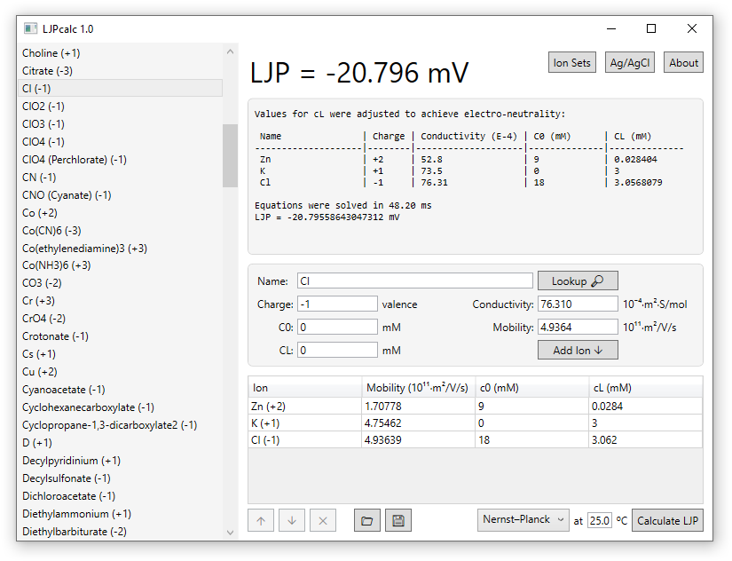

# LJPcalc

LJPcalc is a free and open source liquid junction potential (LJP) calculator. LJPcalc is available as a simple click-to-run EXE for Windows and a console application for Linux and MacOS.

### Download for Windows (64-bit): ~~[LJPcalc.zip]()~~

> ⚠️ **This project is still early in development.** A download link for Windows will be added when development completes in March, 2020. Preview builds are in the [/dev/builds](/dev/builds) folder.

### Download for Linux and MacOS: [LJPconsole](src/LJPconsole)

A cross-platform console version of LJPcalc is available which supports Windows, Linux, and MacOS. See the [LJPconsole page](src/LJPconsole) for installation instructions.

### LJPcalc Mobile

> ⚠️ The LJPcalc mobile app is still in development.

_[NernstApp](https://github.com/swharden/NernstApp) is a Nernst potential calculator for Android_

## Theory

### Calculation Method

LJPcalc calculates the liquid junction potential according to the stationary Nernst-Planck equation which is typically regarded as superior to the simpler Henderson equation used by most commercial LJP calculators. Both equations produce nearly identical LJPs, but the Henderson equation becomes inaccurate as ion concentrations increase, and also when calculating LJP for solutions containing polyvalent ions.

**Ion Charge and Conductivity Library:** Ion charge and conductivities are stored in [IonTable.md](/src/IonTable.md) which is easy to view and modify as needed.

**Note regarding ion sequence:** When calculating LJP for a set of ions it is important to note the following facts. Additional information can be found in [Marino et al., 2014](https://arxiv.org/abs/1403.3640) which describes the exact computational methods employed by LJPcalc.

* **The last ion's concentrations will be recalculated.** LJPcalc will override the concentrations the user provides for the last ion in the set, replacing them with those calculated to achieve electro-neutrality of the ion set.

* **The second-to-last ion's concentration cannot be equal on both sides.** This requirement ensures LJPcalc can properly solve for the final ion.

### Effect of Temperature on LJP

**The LJP is temperature dependent.** There are two sources of temperature-dependent variation: the Einstein relation and the conductivity table. The former can be easily defined at calculation time, while the latter requires modifying conductances in the ion mobility table. These modifications typically have a small effect on the LJP, so standard temperature (25C) can be assumed for most applications.

**The [Einstein relation](https://en.wikipedia.org/wiki/Einstein_relation_(kinetic_theory))** defines diffusion as **`D = µ * k * T`** where:

* **`D`** is the diffusion coefficient
* **`µ`** (mu) is [ionic mobility](https://en.wikipedia.org/wiki/Electrical_mobility)
* **`k`** is the [Boltzmann constant](https://en.wikipedia.org/wiki/Boltzmann_constant) (1.380649e-23 J / K)
* **`T`** is temperature (K)

**The ion conductivity table is temperature-specific.** Ion conductivity was measured experimentally and varies with temperature. The ion conductivity table here assumes standard temperature (25C), but ion conductivity values can be found for many ions at nonstandard temperatures. LJPcalc users desiring to perform LJP calculations at nonstandard temperatures are encouraged to build their own temperature-specific ion tables.

### Calculating Ionic Mobility from Charge and Conductivity

Ionic mobility is **`µ = Λ / (N * e² * |z|)`** where:

* **`µ`** (mu) is [ionic mobility](https://en.wikipedia.org/wiki/Electrical_mobility) (m² / V / sec)
* **`Λ`** (Lambda) is [molar conductivity](https://en.wikipedia.org/wiki/Molar_conductivity) (S * cm²/ mol)
* **`N`** is the [Avogadro constant](https://en.wikipedia.org/wiki/Avogadro_constant) (6.02214076e23 particles / mol)
* **`e`** is the [elementary charge](https://en.wikipedia.org/wiki/Elementary_charge) (1.602176634e-19 Coulombs)
* **`z`** is the absolute value of the [elementary charge](https://en.wikipedia.org/wiki/Elementary_charge) of the ion

### References
* **[Marino et al. (2014)](https://arxiv.org/abs/1403.3640)** - describes a computational method to calculate LJP according to the stationary Nernst-Planck equation. The JAVA software described in this manuscript is open-source and now on GitHub ([JLJP](https://github.com/swharden/jljp)). Figure 1 directly compares LJP calculated by the Nernst-Planck vs. Henderson equation.
* **[Perram and Stiles (2006)](https://pubs.rsc.org/en/content/articlelanding/2006/cp/b601668e)** - A review of several methods used to calculate liquid junction potential. This manuscript provides excellent context for the history of LJP calculations and describes the advantages and limitations of each.
* **[Shinagawa (1980)](https://www.ncbi.nlm.nih.gov/pubmed/7401663)** _"Invalidity of the Henderson diffusion equation shown by the exact solution of the Nernst-Planck equations"_ - a manuscript which argues that the Henderson equation is inferior to solved Nernst-Planck-Poisson equations due to how it accounts for ion flux in the charged diffusion zone.
* **[Lin (2011)](http://www.sci.osaka-cu.ac.jp/~ohnita/2010/TCLin.pdf)** _"The Poisson The Poisson-Nernst-Planck (PNP) system for ion transport (PNP) system for ion transport"_ - a PowerPoint presentation which reviews mathematical methods to calculate LJP with notes related to its application in measuring voltage across cell membranes.
* **[Nernst-Planck equation](https://en.wikipedia.org/wiki/Nernst%E2%80%93Planck_equation)** (Wikipedia)
* **[Goldman Equation](https://en.wikipedia.org/wiki/Goldman_equation)** (Wikipedia)

## Citing LJPcalc

If LJPcalc facilitated your research, consider citing this project by name so it can benefit others too:

> "Liquid junction potential was calculated according to the stationary Nernst-Planck equation using LJPcalc¹"
>
> [1] Harden, SW and Brogioli, D (2020). LJPcalc v1.0. [Online]. Available: https://github.com/swharden/LJPcalc, Accessed on: Feb. 16, 2020.

## Authors
LJPcalc was created by [Scott W Harden](http://swharden.com/) in 2020. LJPcalc began as C# port of [JLJP](https://github.com/swharden/JLJP) by [Doriano Brogioli](https://sites.google.com/site/dbrogioli/) originally published on SourceForge in 2013. LJPcalc is heavily influenced by [Marino et al., 2014](https://arxiv.org/abs/1403.3640).
